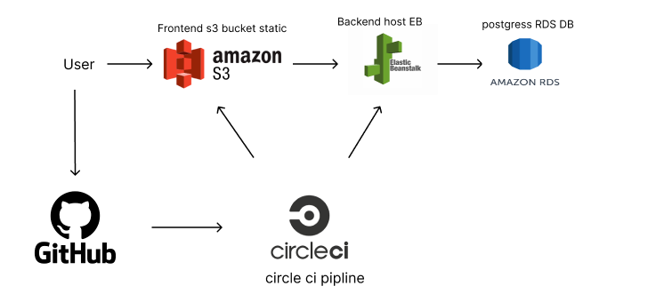

# Infrastructure

## AWS services

1. RDS Postgres : a database store the data of the project.
2. S3 Bucket : static and media storage and host the frontend.
3. Elastic beanstalk : host the backend application

